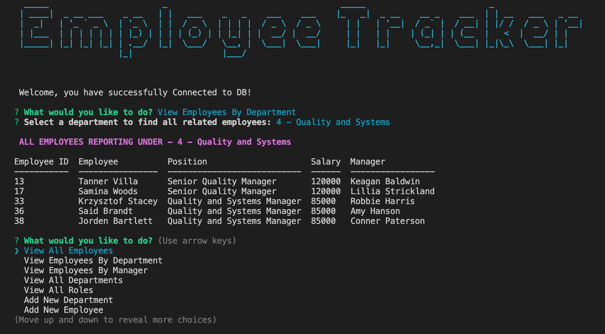

# Employee-Tracker

# Overview

Colourful command line application which allows the end user to interact with an Employee Database.  

# Functionality

The end user is able to complete the following functions;

### View 
* All Employees
* All Employees by Department
* All Employees by Manager
* All Departments
* All Roles
* Total buget utilised

### Add
* Department
* Role
* Employee

### Update
* Employee Current Role
    

# Images

### Initial Screen

### View Employees by Department

# Video

Video showcasing entire command line application can be found [here](public/video/employeaplication.mov)

# Contact

All queries relating to this repo should sent to [rob.sonter@newstartdigital.com.au](mailto:rob.sonter@newstartdigital.com.au)

